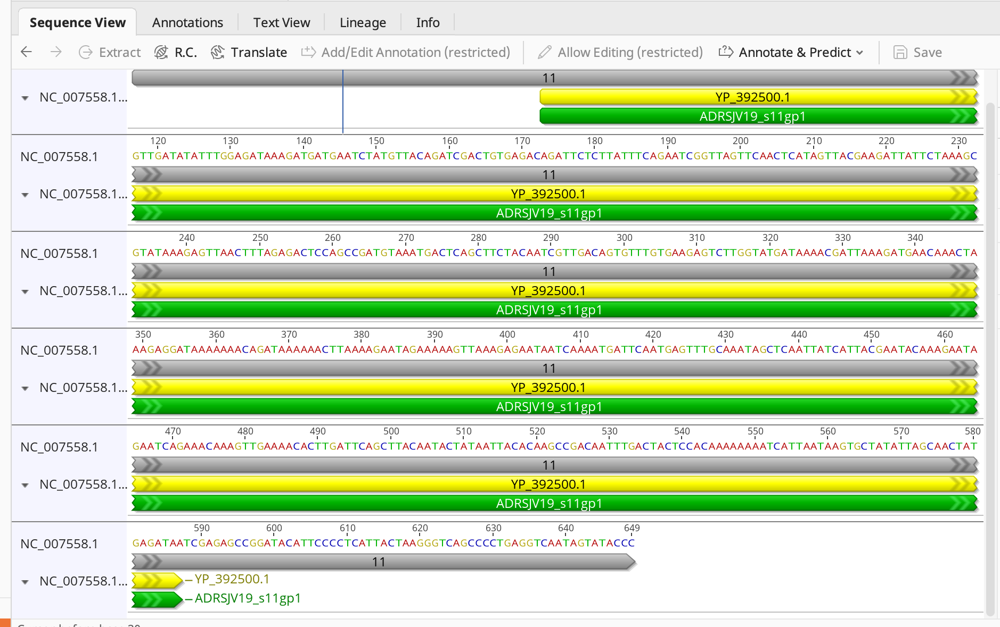
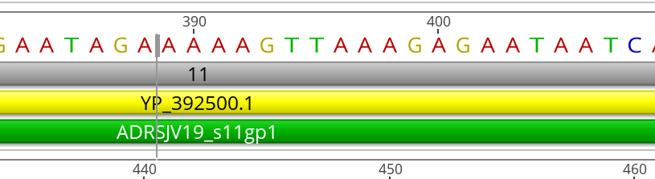
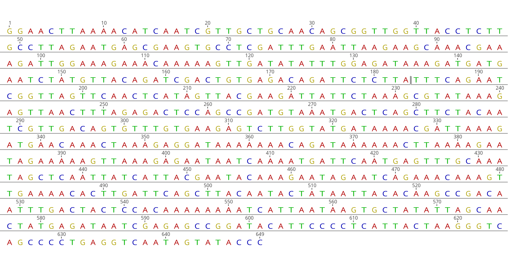

# Week 2 Assignment
## Obtaining genomic data and visualizing it

### Genome Selected
Rotavirus Strain J19 Segment 11 Complete Genome
```Accession Number: NC_007558.1```

### Running the makefile
Use the following command
```make```

This command will download the fasta and gff file in a directory called "sequences"

If you wish to delete the results of the makefile, use:
```make clean```

### Information about the genome

Genome Length
```649bp```

Number of chromosomes
```No true chromosomes since it is a rotavirus genome```

Number of annotations in the annotation file
```There are three annotations in the file. One region, One gene and One CDS```

How complete is this genomic build
```This represents the segment 11 of the rotavirus J19, and seems complete```

### Visualization questions

How tightly packed are the genes in this genome? Estimate the gene-to-gene distance via the browser.

```Since this represents one segment of the rotavirus genome, there is only one gene starting from position 57 to 587bp. Gene-to-gene distance is not applicable for this genome. The gene codes for non structural protein 5, which is 176 amino acids long```




Pick a coordinate on the chromosome and visually inspect the sequence regions around it.

```Inspecting a region of the genome```



Describe all six reading frames (codons) that the coordinate could be part of.

```Not applicable to this specific genome```

Identify the type of feature displayed as a data track.

```There's three annotations displayed as data track```

Color features by their strand orientation.

```Since this is a rotavirus genome segment 11 sequence, it only has one gene which is only in the forward stand, hence the coloring is not applicable```



