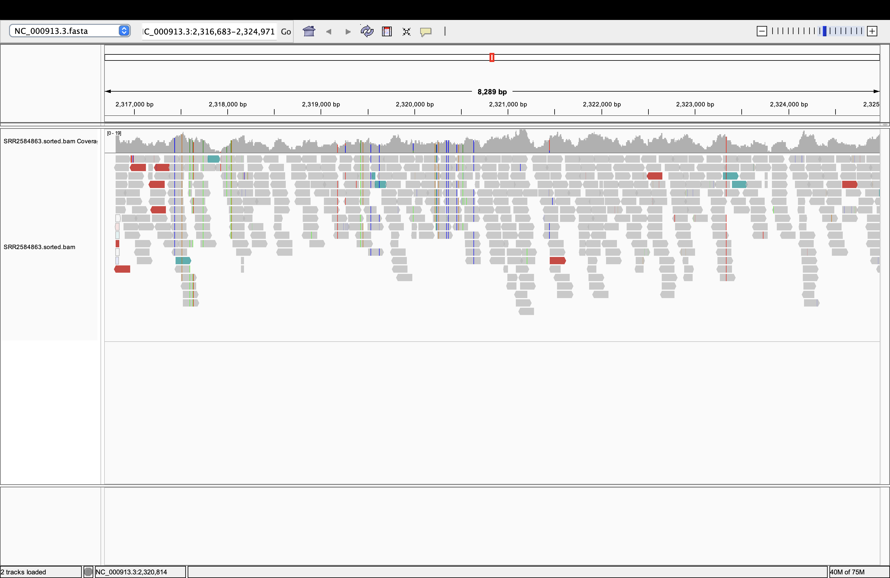
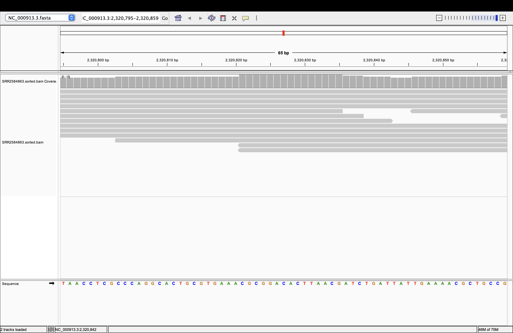

# Week 05:  Align Reads and Generate a BAM File

## Overview

This pipeline downloads a reference genome (*E. coli* K-12 MG1655, `NC_000913.3`) and
sequencing reads (`SRR2584863`), trims the reads, aligns them to the genome with `bwa mem`,
and produces a sorted, indexed BAM file with an alignment statistics report.

## How N was chosen

Target coverage was 10x

Coverage formula wsa found (paired-end): C = (N * L * 2) / G

After solving for N, it was set to 155000.

## How to run

```bash
make clean
make
```

## Results

### Alignment rate
Mapped: 94.23%
Properly paired: 91.93%

### What the alignments look like
Most reads align cleanly with some base mismatches.

### Coverage uniformity
Coverage is fairly uniform across the genome.

## IGV screenshot




(Load `sequences/NC_000913.3.fasta` as the genome and `bam/SRR2584863.sorted.bam`
as the track in IGV, then save the screenshot into this folder.)