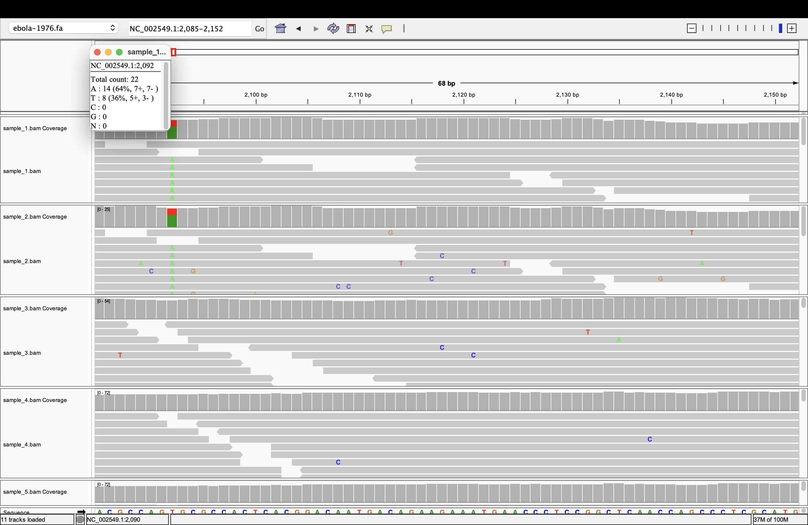
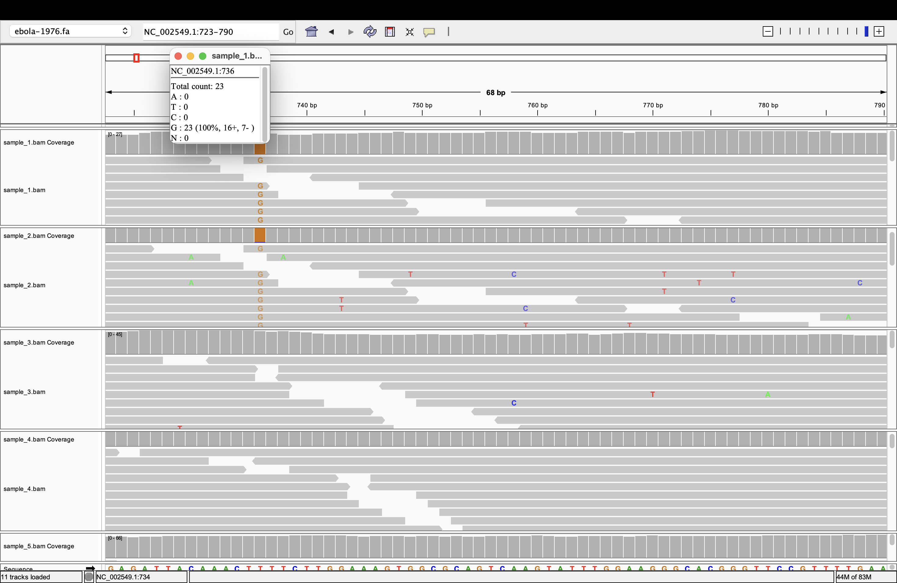
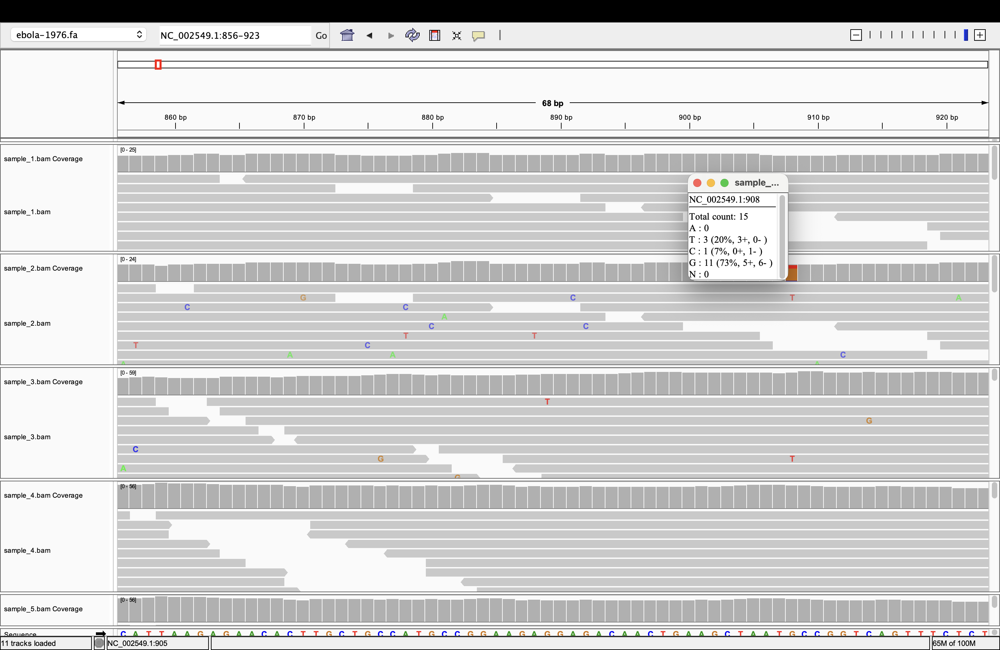
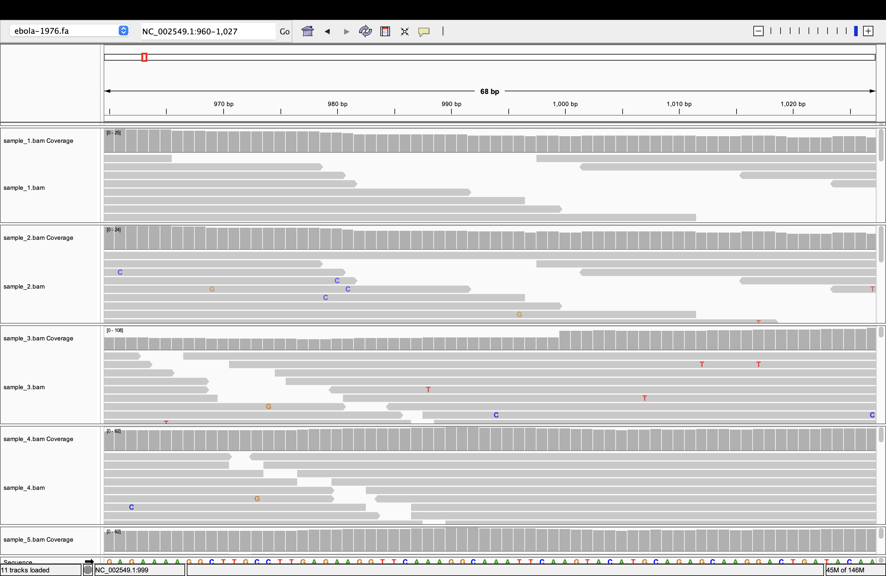
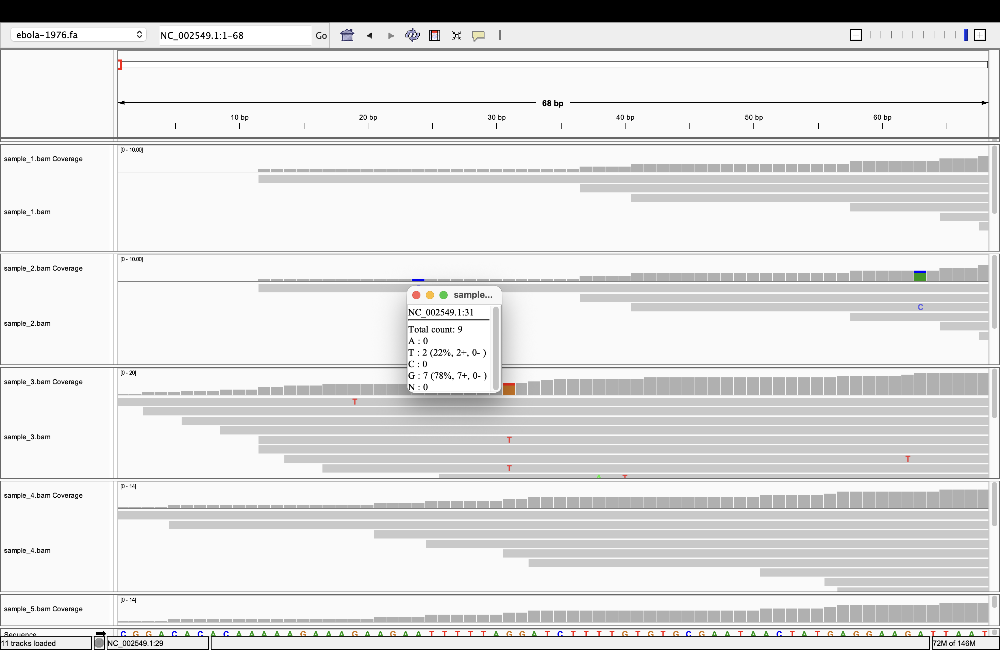
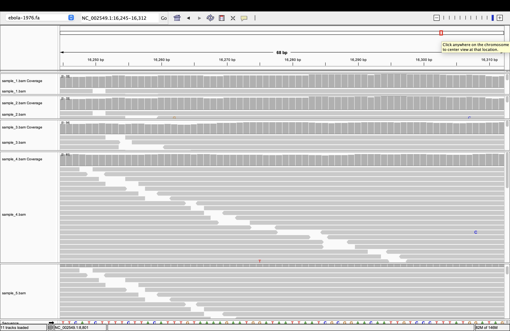
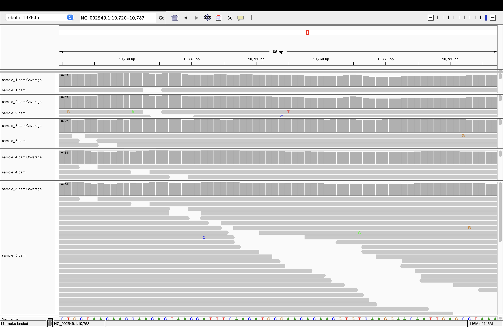

# Week 6: Evaluate structural variants

## File 1
Interestingly, for the first file, the coverage across the genome remains relatively stable with normal fluctuations. 
Variants were a bit difficult to find in this file, however, some variants were identified which are shown in the images below. 


We can see in the reference genome at ```NC 002549.1:2,092```, there is the base pair T, however in the reads there is some disagreement between A and T with 64% of reads leaning towards A

## File 2
This file has a lot more disagreements in the reads. There are reads where the base pair differs from the reference genome, but the other reads make up for this inaccuracy. However, there are positions in the genome where there are strucutural varinats present too, as shows in images below. 




## File 3
This sample has quite a few diagreements in the reads too. However, these reads present fewer structural variants than sample 2. This sample also had fewer SNPs than sample 2. There is a section where the coverage drops down drastically which is shown in the image below. This sample also has a variant early on in the reads which is shown in the second image. 




## File 4
Sample 4 seems very complete. It has very few disagreements with the reference genomes and very few to none structural variants. The coverage seems pretty good, although it does dip in a few sections, however that is expected. There were several positions in the chromosome where some of the reads disagreed with the reference genome, however they were corrected by majorite of other reads at that position being accurate. 



## File 5
Sample 5 is quite similar to sample 4 in the sense that there are very few to none structural variants. The coverage seems pretty uniform. However, like sample 4, sample 5 has a few single base pairs disagreements with the reference genome which are ultimately corrected by the other majority correct reads at that position. 




