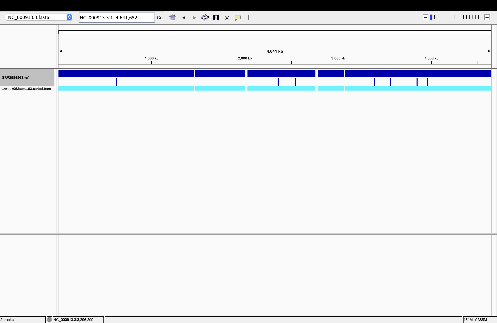
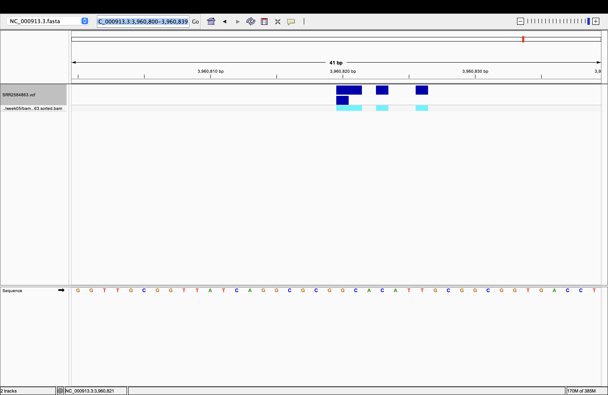
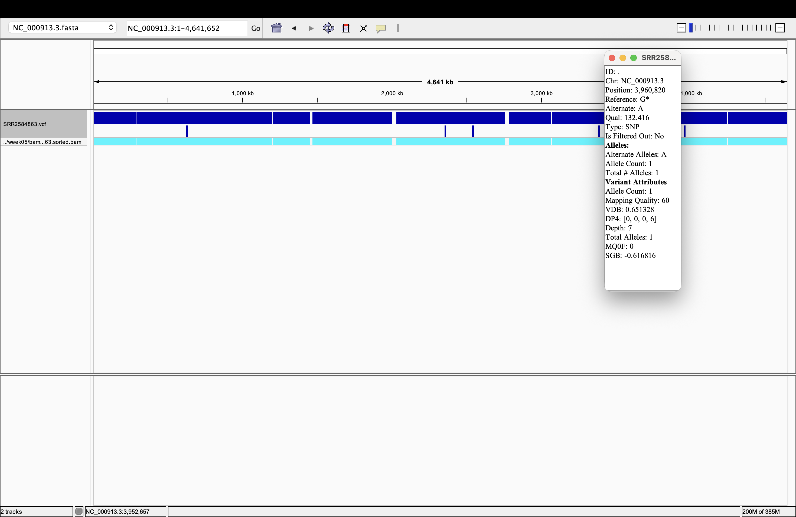

# Week 07: Variant calling from the BAM file

This workflow starts from the aligned reads generated in week 05 a file named `SRR2584863.sorted.bam` under the bam file folder and calls variants against the reference genome (`../week05/sequences/NC_000913.3.fasta`). The final output is a VCF file containing single-nucleotide variants and short indels.

## Coverage check

```
C = (N * L * 2) / G
C ≈ (155000 * 150 * 2) / 4600000 ≈ 10x
```

This satisfies the minimum 10x coverage target required for reliable variant calling.

## How to run

From the repository root:

```
cd week07
make clean
make
```

This will create two files:

- `results/SRR2584863.vcf`
- `results/SRR2584863.stats.txt`

## HOw many variants are called?

The final VCF contains 33,296 variant records.

## What type of variants are present?

 of which 33,054 are SNPs and 242 are indels.

## Which calls look real vs. likely errors?

Some calls appear promising because they have high mapping quality and multiple reads supporting the alternate allele. However, calls with low read depth or those located in repetitive regions may be sequencing or alignment errors
A high QUAL score is useful evidence, but it does not by itself rule out these artifacts.

In the IGV detail view, the SNP at `NC_000913.3:3,960,820` (`G>A`) has QUAL 132.416 and mapping quality 60, with six alternate-supporting reads reported (`AD=0,6`; `DP4=0,0,0,6`). This is evidence for the call, but its depth is only 7 and the reported alternate support is all in one DP4 orientation category. I would describe it as a plausible candidate that needs read-level inspection, not as a confirmed real variant.

## Alignment support

The BAM track provides evidence to evaluate each VCF call, but the fact that reads were aligned to the reference does not establish that every call is real. At a useful zoom level, check whether multiple reads support the alternate base, whether they align cleanly across the site, and whether support is consistent across orientations and read pairs. The whole-contig view is useful for locating calls, but is too zoomed out to assess individual read support.

## IGV visualizations
The reference genome was loaded and VCF file is displayed as track



This one shows the details of the variant:

